```{r include=FALSE}
library(magrittr)
```


# Materials

Note:  We use Sigma	Product: C2020  as our MALDI matrix, however we also recrystallize before use to purify it further. Sigma also sells a higher-grade MALDI matrix.

```{r echo=FALSE, message=FALSE, warning=FALSE}
dat <- readxl::read_excel("materials.xlsx")

knitr::kable(dat)
```


# Metcalf Lab

## Cultivating Bacteria

Prepare the following solution and scale ingredients to the volume needed. Autoclave to sterilize.

  - Soluble starch: 5 g
  - Yeast extract: 2 g
  - Peptone: 1 g
  - Agar: 7.5 g
  - Deionized water: 500 mL


If using 60 mm or larger petri-dishes, make a dilution-streak of a single strain on a single dish to to allow the formation of individual colonies.
If using multi-well plates, plate each strain into 8 different wells. 

Allow the bacteria to grow for a period of 7 days. (e.g. Inoculate agar plate on Monday -> put onto MALDI plate the following Monday).

  - Because it is still unclear whether time has an effect on MALDI spectra of different types of bacteria, it is important to plate bacteria at similar timepoints.

___


## Documenting sample positions on MALDI plates
If you haven't already, download the Excel template [here.](https://drive.google.com/a/uic.edu/file/d/1QrHYVfDiLrmXUmdmfasUikIfbzD_eOx9/view?usp=sharing) 

- Using the Excel template mentioned above, simply enter your sample names into the blue-boxes at the top of the spreadsheet. Excel will then assign these to spots on the depicted MALDI plate.
- Also, in the appropriate cells of the excel sheet, enter the product number and lot/batch number of MALDI matrix used. 


If you don’t have access to Microsoft Excel, you can use any other spreadsheet software such as:  Apache OpenOffice™ "Calc", which can be found at [www.openoffice.org](www.openoffice.org). When saving the file, ensure you save it as type "Microsoft Excel 97/2000/XP (.xls or .xlsx)".


## Naming the excel file
- The excel file will be saved as the date the plate was started and the last five-digits of the MALDI target plate serial number:
    - Filename: *yyyy_mm_dd_sssss* 
    - (year_month_day_LastFiveOfSerialNumber)

___


## Cleaning the MALDI plate
Before applying bacteria:  

  1. Remove target plate from holder and briefly rinse with HPLC grade methanol.
  2. Air-dry (~5-10 min until dry), prevent touching or contaminating the top surface of the plate (the side with writing and MALDI-spot circles)


## MALDI Matrix Preparation
1. Prepare 10 mg/mL MALDI-grade [alpha-cyano-4-hydroxycinnamic acid](http://www.sigmaaldrich.com/catalog/search?term=28166-41-8&interface=CAS%20No.&N=0&mode=partialmax&lang=en&region=US&focus=product) (CHCA) in MS-grade solvents:
   - 50% Acetonitrile (ACN)
   - 47.5% Water (H<sub>2</sub>O)
   - 2.5% Trifluoroacetic Acid (TFA)
     - e.g. 400 µL of solution = 200 µL ACN + 190 µL H<sub>2</sub>O + 10 µL TFA + 4 mg CHCA

- Sonicate or vortex the solution until no matrix crystals are observed. The matrix is then ready to be applied.


- You will need to make enough matrix solution to have at least 1 µL for each MALDI spot. (I recommend making a little more than needed, to account for slight evaporation of matrix while working)
- Use matrix solution within 1 week and store unused solid and prepared CHCA matrix between 2-8 °C, in the dark.

___


## Applying Samples to the MALDI Plate


<center>
```{r, echo = F, out.width = "400px", fig.cap = "When applying bacteria to MALDI plate, your spot should resemble column 2. Column 1 has insufficient cell material, and column 3 has too much cell material"}
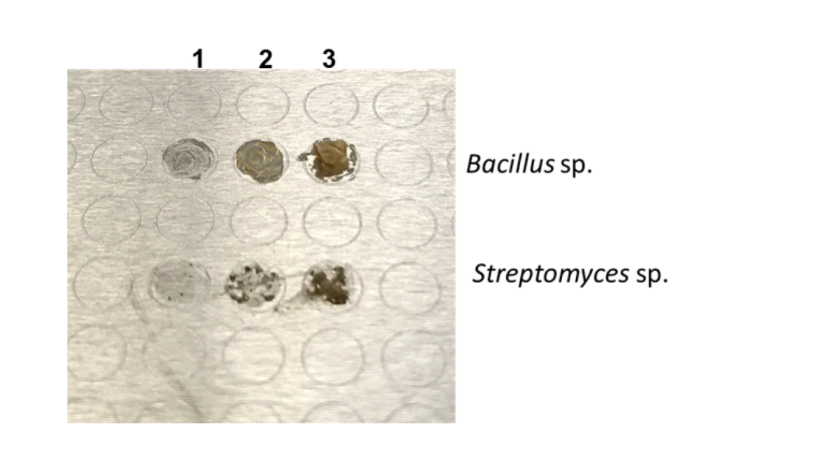
```
</center>


<br>


### Note on Replicates:
Each strain will have 8 biological replicates (8 MALDI spots). Each replicate is the result of touching a toothpick to a different colony/different part of a colony.

If using 60 mm or larger petri-dishes, create only one petri-dish per strain.

  - For each of the eight MALDI spots, cell-material will be taken from a different colony/part of a colony on the petri-dish (or if the petri-dish is completely covered, from eight locations randomly-distributed across the plate). Do not pick colonies of only one morphology/phenotype (e.g. if multiple phenotypes exist such as orange versus orange with black spores, make sure to sample both types within the 8 replicates; if very different phenotypes exist, reassess purity before MALDI analysis).
  
If using multi-well agar plates, create eight different wells per strain.

  - Each of the 8 MALDI spots corresponds to a different well in the multi-well agar plate.  

___


### Applying the Bacteria to the MALDI Plate

|                           |                                          |
| ------------------------- | ---------------------------------------- |
| 1. Apply bacteria directly without any prior chemical treatment. Smear a single bacterial colony in a thin layer directly onto the MALDI target plate using a sterile toothpick. | 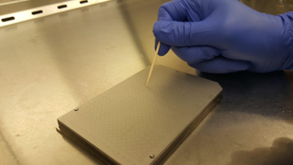 |
| 2. Leave the Calibration spots empty.   |               |
| 3. Add 1 µL of 70% formic acid to each spot containing bacteria. Let air dry. (~5 min) | 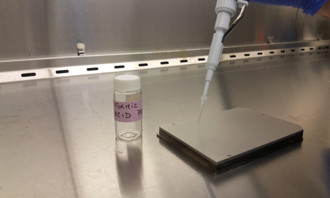            |
| 4. Add 1 µL of MALDI matrix to each bacterial spot, let air dry. (~5 min)   | 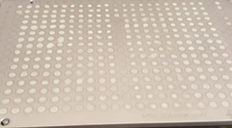          |


# Murphy Lab

## Cleaning the MALDI plate
The MALDI plate should be properly cleaned before shipping. In order to clean the MALDI plate, use the steps below:
method adapted from [Freiwald & Sauer](http://www.nature.com/nprot/journal/v4/n5/full/nprot.2009.37.html?foxtrotcallback=true)

  1. Remove target plate from holder and rinse with acetone.
  2. To remove trace protein/lipids, use non-abrasive liquid soap.
  3. Rinse with distilled water ~2 min to completely remove soap.
  4. Sonicate in HPLC grade water (Ultrasonic bath) for ~5 min.
  5. Rinse with HPLC grade water.
  6. Rinse with HPLC grade methanol.


## Acquiring Data

Each plate will require multiple calibration spots. For protein data, follow the directions in the pdf link below:
  - Bruker Biotyper calibration procedure: 
    - https://www.bruker.com/fileadmin/user_upload/8-PDF-Docs/Separations_MassSpectrometry/InstructionForUse/IFU_Bruker_Bacterial_Test_Standard_Revision_C.pdf


```{r echo=FALSE, message=FALSE, warning=FALSE}


text1 <- "Insert MALDI plate into the mass spectrometer"
text2 <- "Select the appropriate IDBac Method"
text3 <- "Under the \"AutoXecute\" control panel select \"New\", which is to the right of \"Run\""
text4 <- "If it wasn’t automatically detected, select the appropriate MALDI target plate geometry."
text5 <- "Manually determine the minimum laser fluency/power needed and then press \"Set initial laser power\" before beginning the run"
text6 <- "Select \"Calibrate with own template\" and then select \"New\""
text7 <- "Follow the directions in the left panel and then select \"OK\""
text8 <- "Select \"Next\""
text9 <- "Within the \"run parameters\" page it is important to ensure the correct methods are selected in the correct places. \\\n For small molecule runs, change both autoXecute methods to: \"IDBac_Small-Molecule_autoX\". \\\n For protein runs, change both autoXecute methods to: \"IDBac_Protein_AutoX.axe\".  \\\n There are four flexAnalysis methods: \\\n Either the protein or small molecule \"...Calibrant Calibration\" should be selected within the calibration box’s \"flexAnalysis Method\" pull-down menu. \\\n The matching protein or small molecule \"...Unknown Sample Calibration\" method should be selected within the second \"flexAnalysis Method\" pull-down menu. When you have finished, select \"Next\""
text10 <- "Select \"Save as\" and save the sequence run to your data directory. Confirm and select \"OK\""
text11 <- "Under the \"AutoXecute\" control panel select \"Start automatic Run\""


pict1 <- paste0("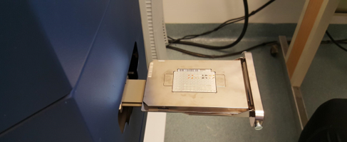")
pict2 <- paste0("")
pict3 <- paste0("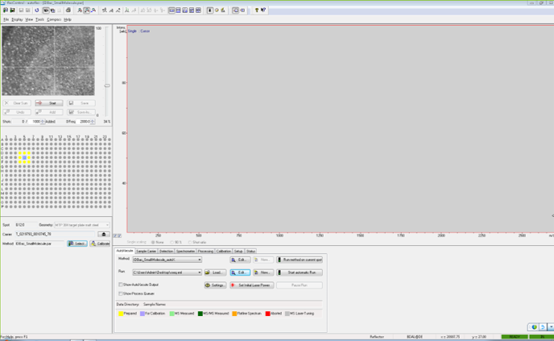")
pict4 <- paste0("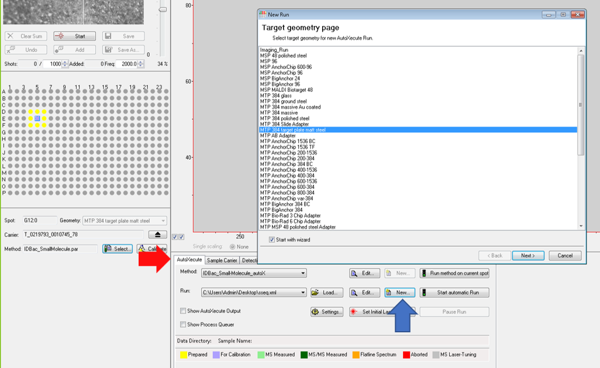")
pict5 <- paste0("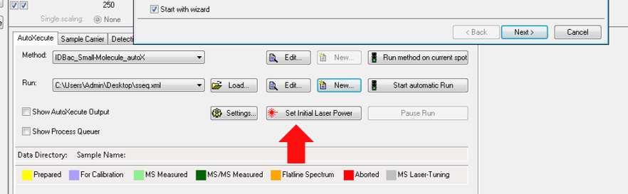")
pict6 <- paste0("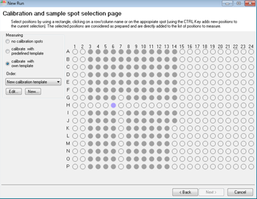")
pict7 <- paste0("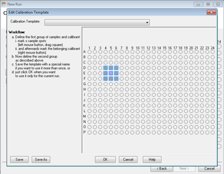")
pict8 <- paste0("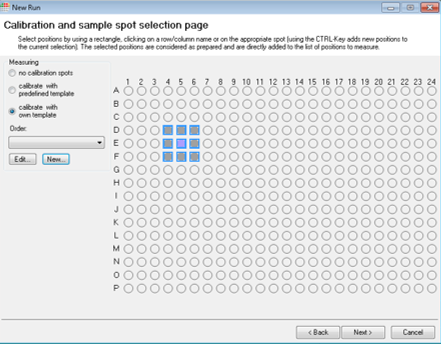")
pict9 <- paste0("")
pict10 <- paste0("")
pict11 <- paste0("")


dat <- data.frame(a = c(text1,
                        text2,
                        text3,
                        text4,
                        text5,
                        text6,
                        text7,
                        text8,
                        text9,
                        text10,
                        text11),
                  b = c(pict1,
                        pict2,
                        pict3,
                        pict4,
                        pict5,
                        pict6,
                        pict7,
                        pict8,
                        pict9,
                        pict10,
                        pict11)
)
kableExtra::kable(dat,col.names = c(""," "),
                  padding = 5, format = "html") %>% 
  kableExtra::column_spec(1, width = "30em") %>% 
    kableExtra::column_spec(2, width = "30em")

```


# Shipping MALDI Plates

  - The plates are to be placed within the plastic Bruker MALDI case, wrapped in ?bubble wrap? and placed inside a XXin x XXin corrugated cardboard box.
  - Request two shipping labels from Rachel or Beth.  One from the Murphy lab to the Metcalf lab and one from the Metcalf lab to the Murphy lab. Make sure to include return addresses.
  - *Request shipping labels for ?? overnight/two-day ?? shipping.*
  - Price of contents = $400 (or whatever MALDI plate costs)


### To the Murphy Lab:

Address:

Dr. Brian T. Murphy  
900 S. Ashland Ave. M/C 870  
MBRB 3114  
Chicago, IL 60607  


Contains:


Return Address:


## To Metcalf Lab 

Address:


Contains:


Return Address:

Dr. Brian T. Murphy  
900 S. Ashland Ave. M/C 870  
MBRB 3114  
Chicago, IL 60607 


___

<H3 align="center">  Data Storage </H3>
<br>


- All raw data will be named/stored in the following format:
  - Per MALDI plate
    - Each run will be saved within a folder named with the same name as the corresponding excel file, in the format yyyy_mm_dd_sssss
    - The protein run will be saved within this yyyy_mm_dd_sssss folder, in a directory called "p"
    - The small molecule run will be saved within this yyyy_mm_dd_sssss folder, in a directory called "s"
    -   
  
    
- The correspdonding excel file will be placed inside the yyyy_mm_dd_sssss folder
- Each yyyy_mm_dd_sssss folder will then be saved for long-term storage by compressing to ".7z" with 7-zip. https://www.7-zip.org/
  - This will immediately be stored:
    - Locally on a RAID device. Location:
    - In the cloud (google team drive). Location: team drive named "R01_IDBac" "R01_IDBac/database-data/data".
    

___
