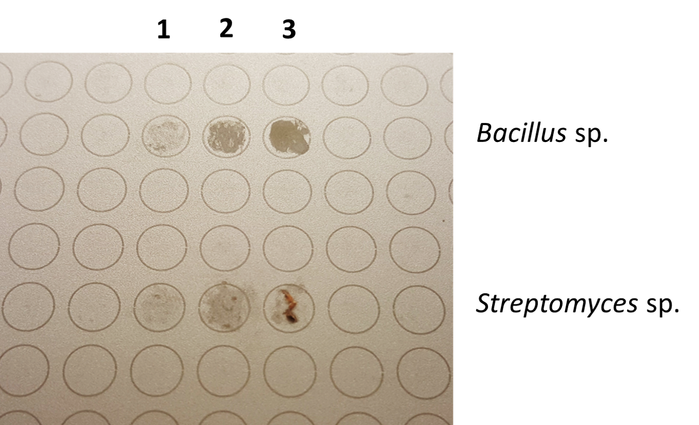

___

<H1 align="center"> Sample Preparation </H1>

If you haven't already, download the Excel template for renaming raw data files [here.](/MALDI-Plate_Template/384_Spot_MALDI_Template.xltx) This template was designed to work with MALDI plates of up to 384 spots.

___

- Using the Excel®/OpenOffice™ template mentioned above, simply enter your sample names into the spreadsheet as seen below.

  

If you don’t have access to Microsoft Excel, we have successfully tested this with the free Excel alternative:  Apache OpenOffice™ “Calc”, which can be found at [www.openoffice.org](www.openoffice.org). When saving the file, ensure you save it as type “Microsoft Excel 97/2000/XP (.xls)”.

- The excel file will be named as the date the plate was created and the last five-digits of the MALDI-target-plate serial number:
    - *dd_mm_yyyy_sssss* 
    - Use format above, which stands for: (day_month_year_LastFiveOfSerialNumber)

___

### Cleaning MALDI Target Plates

The MALDI plate should be properly cleaned before use.  In order to clean the MALDI plate, use the steps below:
(method adapted from [Freiwald & Sauer](http://www.nature.com/nprot/journal/v4/n5/full/nprot.2009.37.html?foxtrotcallback=true))

1. Remove target plate from holder and rinse with HPLC grade methanol.
2. Air-dry, prevent touching or contaminating the top surface of the plate (the side with writing and MALDI-spot circles)

___

### MALDI Matrix Preparation
1. Prepare 10 mg/mL MALDI-grade [alpha-cyano-4-hydroxycinnamic acid](http://www.sigmaaldrich.com/catalog/search?term=28166-41-8&interface=CAS%20No.&N=0&mode=partialmax&lang=en&region=US&focus=product) (CHCA) in MS-grade solvents:
   - 50% Acetonitrile (ACN)
   - 47.5% Water (H2O)
   - 2.5% Trifluoroacetic Acid (TFA)
     - e.g. 400 µL of solution = 200 µL ACN + 190 µL H2O + 10 µL TFA + 4 mg CHCA
     
- You will be using 1 µL per MALDI spot.
- Use matrix solution within 1 week and store unused solid and prepared CHCA matrix between 2-8 °C, in the dark.

___

<H3 align="center">  Applying Samples to the MALDI Plate </H3>

 

|                           |                                          |
| ------------------------- | ---------------------------------------- |
| 1. Apply bacteria directly without any prior chemical treatment. Smear a single bacterial colony in a thin layer directly onto the MALDI target plate using a sterile toothpick. |  |
| 2. Leave the PepMix and BTS spots empty.   |               |
| 3. Add 1 µL of 70% formic acid to each bacterial spot, let air dry. |             |
| 4. Add 1 µL of MALDI matrix to each bacterial spot, let air dry.    |           |

___
<H3 align="center">  Shipping MALDI Plates to Murphy Lab </H3>
 

Use the Shipping Label found here:

Address:

c/o

Contains:

___

<H3 align="center">  Shipping MALDI Plates to Metcalf Lab </H3>
 

##### Cleaning MALDI Target Plates

The MALDI plate should be properly cleaned before shipping.  In order to clean the MALDI plate, use the steps below:
method adapted from [Freiwald & Sauer](http://www.nature.com/nprot/journal/v4/n5/full/nprot.2009.37.html?foxtrotcallback=true)

1. Remove target plate from holder and rinse with acetone.
2. To remove trace protein/lipids, use non-abrasive liquid soap.
3. Rinse with distilled water ~2 min to completely remove soap.
4. Sonicate in HPLC grade water (Ultrasonic bath) for ~5 min.
5. Rinse with HPLC grade water.
6. Rinse with HPLC grade methanol.

Use the Shipping Label found here:

Address:

c/o

Contains:

___

<H3 align="center">  Data Storage </H3>
 

- All raw data will be named/stored in the following format:
  - Per MALDI plate
    - Each run will be saved within a folder named with the same name as the corresponding excel file, in the format dd_mm_yyyy_sssss
    - The protein run will be saved within this dd_mm_yyyy_sssss folder, in a directory called "p"
    - The small molecule run will be saved within this dd_mm_yyyy_sssss folder, in a directory called "s"
    -   (Picture has dashes instead of underscores)
  
    
- The correspdonding excel file will be placed inside the dd_mm_yyyy_sssss folder
- Each dd_mm_yyyy_sssss folder will then be saved for long-term storage by compressing to ".7z" with 7-zip. https://www.7-zip.org/
  - This will immediately be stored:
    - Locally on a RAID device. Location:
    - In the cloud. Location:

___
