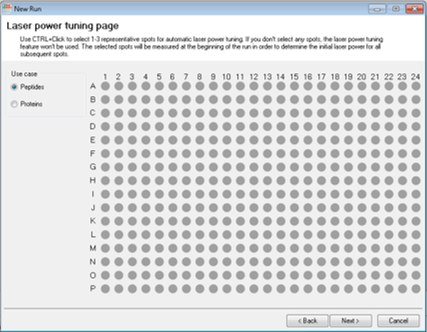
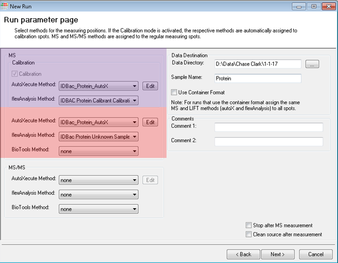
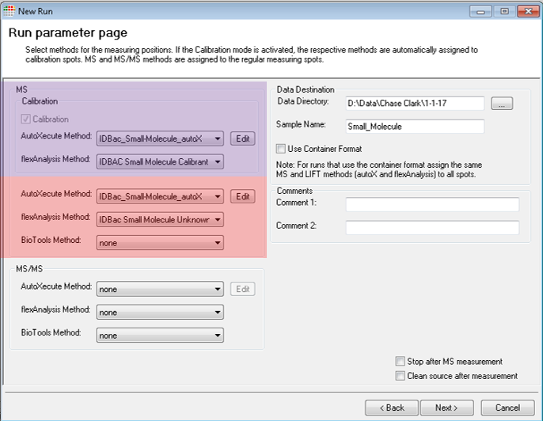
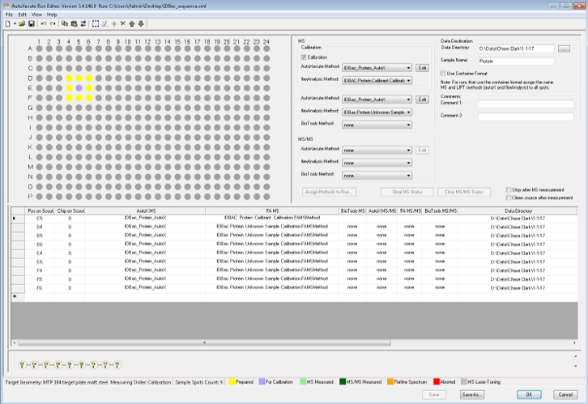
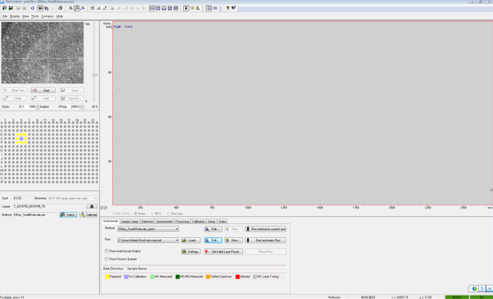

```{r results='asis'}
dat <- data.frame(a = "sdsds",flag = 1)
dat$flag <- sprintf('')
library(knitr)
kable(dat)
```


# Metcalf Lab


## Documenting sample positions on MALDI plates
If you haven't already, download the Excel template [here.]() 

- Using the Excel®/OpenOffice™ template mentioned above, simply enter your sample names into the spreadsheet as they are going to be placed on the MALDI plate .
- Also, in the appropriate space in the excel sheet, enter the product and lot/batch number of MALDI matrix. 


If you don’t have access to Microsoft Excel, you can use any other spreadsheet software such as:  Apache OpenOffice™ “Calc”, which can be found at [www.openoffice.org](www.openoffice.org). When saving the file, ensure you save it as type “Microsoft Excel 97/2000/XP (.xls or .xlsx)”.


## Naming the excel file
- The excel file will be named as the date the plate was started and the last five-digits of the MALDI target plate serial number:
    - *dd_mm_yyyy_sssss* 
    - Use format above, which stands for: (day_month_year_LastFiveOfSerialNumber)


## Cleaning the MALDI plate
Before applying bacteria:
  1. Remove target plate from holder and briefly rinse with HPLC grade methanol.
  2. Air-dry, prevent touching or contaminating the top surface of the plate (the side with writing and MALDI-spot circles)


## MALDI Matrix Preparation
1. Prepare 10 mg/mL MALDI-grade [alpha-cyano-4-hydroxycinnamic acid](http://www.sigmaaldrich.com/catalog/search?term=28166-41-8&interface=CAS%20No.&N=0&mode=partialmax&lang=en&region=US&focus=product) (CHCA) in MS-grade solvents:
   - 50% Acetonitrile (ACN)
   - 47.5% Water (H<sub>2</sub>O)
   - 2.5% Trifluoroacetic Acid (TFA)
     - e.g. 400 µL of solution = 200 µL ACN + 190 µL H<sub>2</sub>O + 10 µL TFA + 4 mg CHCA
     
- You will be using 1 µL per MALDI spot.
- Use matrix solution within 1 week and store unused solid and prepared CHCA matrix between 2-8 °C, in the dark.

___

## Applying Samples to the MALDI Plate


<center>
```{r, echo = F, out.width = "400px", fig.cap = "When applying bacteria to MALDI plate, your spot should resemble column 2. Column 1 has a little cell material, and column 3 has too much cell material"}
knitr::include_graphics("ReadMe_Images/jove.png")
```
</center>


<br>


|                           |                                          |
| ------------------------- | ---------------------------------------- |
| 1. Apply bacteria directly without any prior chemical treatment. Smear a single bacterial colony in a thin layer directly onto the MALDI target plate using a sterile toothpick. |  |
| 2. Leave the Calibration spots empty.   |               |
| 3. Add 1 µL of 70% formic acid to each spot containing bacteria. Let air dry. |             |
| 4. Add 1 µL of MALDI matrix to each bacterial spot, let air dry.    |           |


# Murphy Lab

## Cleaning the MALDI plate
The MALDI plate should be properly cleaned before shipping. In order to clean the MALDI plate, use the steps below:
method adapted from [Freiwald & Sauer](http://www.nature.com/nprot/journal/v4/n5/full/nprot.2009.37.html?foxtrotcallback=true)

  1. Remove target plate from holder and rinse with acetone.
  2. To remove trace protein/lipids, use non-abrasive liquid soap.
  3. Rinse with distilled water ~2 min to completely remove soap.
  4. Sonicate in HPLC grade water (Ultrasonic bath) for ~5 min.
  5. Rinse with HPLC grade water.
  6. Rinse with HPLC grade methanol.


## Acquiring Data

Each plate will require multiple calibration spots. For protein data, follow the directions in the pdf link below:
  - Bruker Biotyper calibration procedure: 
    - https://www.bruker.com/fileadmin/user_upload/8-PDF-Docs/Separations_MassSpectrometry/InstructionForUse/IFU_Bruker_Bacterial_Test_Standard_Revision_C.pdf


|               |               |
| ------------- | ------------- |
| 1. Insert MALDI plate into the mass spectrometer| <a href="acquisiton_images/Acquire1.PNG" align="center">   </a> |
| 2. Select the appropriate IDBac Method  | <a href="acquisiton_images/Acquire13.png" align="center">  </a>    |
| 3. Under the “AutoXecute” control panel select “New”, which is to the right of “Run” 									|  <a href="acquisiton_images/Acquire2.PNG" align="center">  </a>    |
| 4. If it wasn’t automatically detected, select the appropriate MALDI target plate geometry. 					|  <a href="acquisiton_images/Acquire3.PNG" align="center">   </a>    |
| 5. (Optional) Follow the directions to choose representative spots for laser power tuning and select “Next”   |  <a href="acquisiton_images/Acquire4.PNG" align="center">   </a>    |
|  Note: If you skip step 5, you should manually determine the minimum laser fluency/power needed and then press “Set initial laser power” before beginning the run         |  <a href="acquisiton_images/Acquire5.PNG" align="center">   </a>    |
| 6. Select “Calibrate with own template” and then select “New"             									|  <a href="acquisiton_images/Acquire6.PNG" align="center">   </a>    |
| 7. Follow the directions in the left panel and then select “OK”         										|  <a href="acquisiton_images/Acquire7.PNG" align="center">   </a>    |
| 8. Select “Next”    																							|  <a href="acquisiton_images/Acquire8.PNG" align="center">   </a>    |
| 9. Within the "run parameters" page it is important to ensure the correct methods are selected in the correct places. For small molecule runs change both autoXecute methods to: “IDBac_Small-Molecule_autoX”. For protein runs change both autoXecute methods to: “IDBac_Protein_AutoX.axe”.  There are four flexAnalysis methods: The protein or small molecule “Calibrant Calibration” should be selected within the calibration box’s “flexAnalysis Method” pull-down menu.  IDBac Protein Calibrant Calibration IDBac Small Molecule Calibrant Calibration. The protein or small molecule “Unknown Sample Calibration” should be selected within the second “flexAnalysis Method” pull-down menu. IDBac Protein Unknown Sample Calibration  IDBac Small Molecule Unknown Sample Calibration  When you have finished, select “Next”	| <a href="acquisiton_images/Acquire10.png" align="center">   </a>  <a href="acquisiton_images/Acquire9.png" align="center">   </a>    |
| 10. Select “Save as” and save the sequence run to your data directory.     Confirm and select “OK”       		|  <a href="acquisiton_images/Acquire11.png" align="center">   </a>   |
| 11. Under the “AutoXecute” control panel select “Start automatic Run”              							|  <a href="acquisiton_images/Acquire12.png" align="center">   </a>   |


## Shipping MALDI Plates

  - The plates are to be placed within the plastic Bruker MALDI case, wrapped in ?bubble wrap? and placed inside a XXin x XXin corrugated cardboard box.
  - Request two shipping labels from Rachel or Beth.  One from the Murphy lab to the Metcalf lab and one from the Metcalf lab to the Murphy lab. Make sure to include return addresses.
  - Request shipping labels for ?? overnight/two-day ?? shipping.
  - Price of contents = $400 (or whatever MALDI plate costs)


### To the Murphy Lab:

Address:

Dr. Brian T. Murphy  
900 S. Ashland Ave. M/C 870  
MBRB 3114  
Chicago, IL 60607  


Contains:


Return Address:


## To Metcalf Lab 

Address:


Contains:


Return Address:

Dr. Brian T. Murphy  
900 S. Ashland Ave. M/C 870  
MBRB 3114  
Chicago, IL 60607 


___

<H3 align="center">  Data Storage </H3>
<br>


- All raw data will be named/stored in the following format:
  - Per MALDI plate
    - Each run will be saved within a folder named with the same name as the corresponding excel file, in the format dd_mm_yyyy_sssss
    - The protein run will be saved within this dd_mm_yyyy_sssss folder, in a directory called "p"
    - The small molecule run will be saved within this dd_mm_yyyy_sssss folder, in a directory called "s"
    -   
  
    
- The correspdonding excel file will be placed inside the dd_mm_yyyy_sssss folder
- Each dd_mm_yyyy_sssss folder will then be saved for long-term storage by compressing to ".7z" with 7-zip. https://www.7-zip.org/
  - This will immediately be stored:
    - Locally on a RAID device. Location:
    - In the cloud. Location: "R01_IDBac" google team drive, in the folder "database-data"

___
